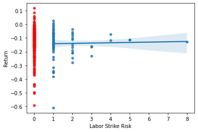
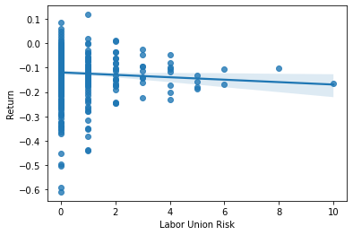
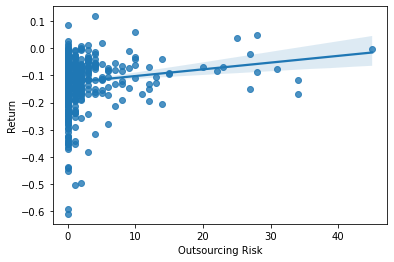
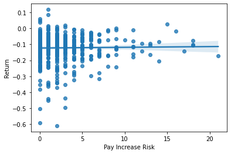
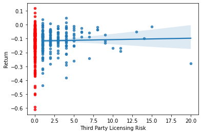

```python
import pandas as pd 
import numpy as np
from near_regex import NEAR_regex
import re
import seaborn as sns
import statsmodels.api as sm
from statsmodels.formula.api import ols as sm_ols

# load data
sample_risks_csv = "Outputs/sp500_accting_plus_textrisks.csv"
sample_risks = pd.read_csv(sample_risks_csv)
```

#### Returns


```python
# download returns
returns_url = 'https://github.com/LeDataSciFi/ledatascifi-2022/raw/main/data/2019-2020-stock_rets%20cleaned.zip'
returns = pd.read_stata(returns_url)

# format date, add week_num var, sort by week
returns['date'] = pd.to_datetime(returns['date'],format="%Y%m%d")
returns ['week_num'] = returns['date'].dt.isocalendar().week
returns = returns.sort_values(['week_num'])

# filter to desired week in 2020 and fix string bug on returns var
returns = returns[returns['week_num']==11].query('date >= "2020-01-01"')
returns['ret'] = pd.to_numeric(returns['ret'])

# calculate weekly cumulative return for each firm
week_returns = (returns
   .assign(R = 1+returns['ret']) # gross returns
   .groupby(['ticker','week_num']) # for firm and week
   ['R'].prod() -1
).to_frame()

# save to final dataframe
sample_final = pd.merge(sample_risks,week_returns,how='left',left_on='Symbol',right_on='ticker',validate='1:1')
```

## Risk Measurements

#### Text Search and Capture Method

All of the following risks were captured through text searches in firm 10-K filings that were downloaded from S&P500 firms. The text search was done through a regular expression method called 'NEAR_regex'. This method inputs search words, their maximum distance apart, and the cleaned 10-K files and returns a regex string that I used to count the cases where my input words were near each other / existed.

#### Labor Risk

The first risk that I explored pertained to companies labor sources/methods and potential complications. I chose to investigate labor within the S&P 500 firms due to the great impact that COVID-19 had on (un)employment as well as the size of the firms on this list. These companies being selectively large encouraged me to pursue this topic as I figured the data would be more present as larger companies tend to have more employees and pay closer attention to their labor. The aspects of labor that I intended to pinpoint through my regex search in firm 10-K's were **_strikes, unions, and outsourcing_**.


Labor _strikes_ are inherently problematic for companies. I hypothesized that firms that were dealing with labor strikes in some manner when COVID hit experienced worse returns than those that weren't. Data collection for this risk measurement checked the closeness of the words 'labor' and 'strike(s)'. The Labor Strike Risk variable is interpreted as a categorical variable in the sense that I only noted firms as either mentioning strikes or not. The data presence for this risk is low, such that up until the ~85th percentile, it has no mention. This was anticipated as labor strikes are uncommon.

Labor _unions_ were observed due to potential tension on employee relationships. I hypothesized that firms that mentioned labor unions more in their 10-K's had more issues in their employee relations and therefore experienced more negative returns from COVID. Less than a quarter of the working population in even the most unionized states are in unions so, once again, hits on the search were limited. However, this time returning 25% of 10-K's, the variable will be used as a measurable variable as I dig into potential correlations between the firms that mentioned it more (up to 10 times) vs the ones that did once. Similar to strikes, the words 'labor' and 'union(s)'.

_Outsourcing_ Labor was the final labor variable that I measured. COVID having an extensive international impact, I was curious how companies that were dependent on international workers managed their labor. After measuring two local employment risks I wanted to ensure I accounted for outsourced labor. I hypothesized that companies that mention outsourcing more in their 10-K's experienced worse returns during COVID. Outsourced labor being comparatively cheap, it is relatively popular with roughly 50% hits on 10-K searches. The positive hits are used as a measurable variable to explore correlations between using the word and potential return variation. The _topic_ of outsourcing was my only interest for this risk and it is often paired with various words that would lead to misleading hits when attempted to be paired in a search. Due to this, I used regex and inputted purely 'outsource|outsourced|outsourcing' as the search.

#### Pay Increase Risk

The next risk that I measured was regarding pay increase risk in firms. I chose to measure pay risk in firms due to the tension around wage(s) that COVID caused. My hypothesis was that firms that mentioned a 'salary/compensation' 'increase' more frequently would have experienced worse returns over COVID. Roughly 70% of 10-K's mentioned pay increase at least once, most of them mentioning it 2 or more times. Using the number of hits per firm 10-K in my analysis makes this a measurable variable that explores the potential relationship between number of mentions and return. This variable could be linked to accounting variables such as wages/salaries payable as an increase in that is likely correlated to an increase in pay all else equal.

#### Third-Party Licensing Risk

The final risk that I measured relates to firms and third party licensing. I hypothesized that firms that depended on licensing from third parties was more susceptible to negative returns from COVID. I wanted to explore this risk as a different angle on dependency like outsourcing. Considering most companies experienced poor returns due to COVID it seemed plausible to me that companies that relied on other companies saw a buildup and backfire. This variable reaches a smaller list of firms and is not a very common thing to mention on 10-K's. This is shown as only about 35% of firms mention it in their 10-K's and when they do it's usually just once. As a result, I am using this as a categorical variable counting simply whether a firm mentioned it or not. To search for this variable I checked the closeness of 'third part' and 'licens' which may seem like incomplete words but actually utilizes a regex boolean feature of "partial" that allows partial matches for words. This allows me to get matches for 'license' and 'licensing' both from inputting 'licens', for example.

## Validation Check

#### Labor Strike Risk

Likely a variable with valid measurement:
   - Unique words that are infrequently found together
   - Limited words apart to 5 to ensure relation
   - Used 'labor' with 'strike' for accuracy
   - Firm with highest results is APTV (Aptiv Inc.) which had 18,000 workers walk-out in Jan. 2020

##### Examples


```python
# words to look for
lr1_words = ['labor','(strike|strikes)']
```

Text I want regex to count and it does:


```python
good_text = "As GM is one of our largest customers, this labor strike adversely impacted our financial condition, operating results and cash flows for the year ended December 31, 2019."

lr1_words = ['labor','(strike|strikes)']
print(len(re.findall(NEAR_regex(lr1_words,5),good_text)))
```

    1


Close text I don't want regex to count and it correctly doesn't:


```python
bad_text = " The fair value of these instruments is based upon valuation models using current market information such as strike price, spot rate, maturity date and volatility."

lr1_words = ['labor','(strike|strikes)']
print(len(re.findall(NEAR_regex(lr1_words,5),bad_text)))
```

    0


Issues with regex search:
   - only counts strike reference if labor is also referenced close to it

Text I want it to pickup but it doesn't:


```python
ideal_text = "interruptions to the Company’s business with its largest customers, distributors and suppliers resulting from but not limited to, strikes, financial instabilities, computer malfunctions or cybersecurity incidents, inventory excesses, natural disasters or other disasters such as fires, floods, earthquakes, hurricanes or explosions."

print(len(re.findall(NEAR_regex(lr1_words,5),ideal_text)))
```

    0


#### Labor Union Risk

Likely a variable with valid measurement:
   - The words are uncommonly used close together but in a different meaning
       - ensured this by limiting words apart to 5
   - Errored on the side of accurate by only measuring union if it was near labor
   - Firm with most results is Delta Air Lines which is largest commercial airline by market cap
       - Pilots and dispatchers are unionized

##### Examples


```python
# words to look for
lr2_words = ['labor','(union|unions)']
```

Text I want regex to count and it does:


```python
good_text = "Our relations with labor unions representing our airline employees in the U.S. are governed by the Railway Labor Act. "

print(len(re.findall(NEAR_regex(lr2_words,5),good_text)))
```

    1


Close text I don't want regex to count and it correctly doesn't:


```python
bad_text = "Under these regulations, any airline with flights originating or landing in the European Union is subject to the ETS and, beginning in 2012, was required to purchase emissions allowances if the airline exceeds the number of free allowances allocated to it under the ETS."

print(len(re.findall(NEAR_regex(lr2_words,5),bad_text)))
```

    0


Issues with regex search:
   - only counts union reference if labor is also referenced close to it

Text I want it to pickup but it doesn't:


```python
ideal_text = "Self help includes, among other things, a strike by the union or the imposition of proposed changes to the collective bargaining agreement by the airline."

print(len(re.findall(NEAR_regex(lr2_words,5),ideal_text)))
```

    0


#### Outsourcing Risk

Likely a variable with valid measurement:
   - Outsourcing is straightforward 
       - I'm just checking its existence so it can't yield a false positive

##### Examples


```python
# words to look for
lr3_words = ['outsource|outsourced|outsourcing']
```

Text I want regex to count and it does:


```python
good_text = "Our core outsourcing services are provided through a national network of four data centers located in four physical locations."

print(len(re.findall(NEAR_regex(lr3_words),good_text)))
```

    1


Issues with regex search:
   - may pickup talk about outsourcing something besides labor

#### Pay Increase Risk

Likely a variable with valid measurement:
 - Checks for both salary and compensation
 - Must have increase within 6 words to return true

##### Examples


```python
# words to look for
pr_words = ['(salary|compensation)','increase']
```

Text I want regex to count and it does:


```python
good_text = "increase of $21 million in compensation and benefits costs primarily due to higher incentive-based compensation accruals in 2019 as compared to prior year"

len(re.findall(NEAR_regex(pr_words,6,partial=True),good_text))
```


    1


Close text I don't want regex to count and it correctly doesn't:


```python
bad_text = "The Act also modified Internal Revenue Code section 162(m), which limits the deduction for compensation with respect to certain covered employees to no more than $1 million per year."

len(re.findall(NEAR_regex(pr_words,6,partial=True),bad_text))
```


    0


Issues with regex search:
 - Could miss over instances of different verbage
     - "pay" increase
     - "wage" increase
     

#### Third Party Licensing Risk

Likely a variable with valid measurement:
 - Very specific search criteria
     - third part and licensing 
 - Unique word combination that exclusively references what I want it to collect
     - virtually no room for over-counting
 - MRNA (Moderna) is highest hit by search
     - pharma companies heavily utilize third party licensing

##### Examples


```python
# words to look for
tplr_words = ['third part', 'licens']
```

Text I want regex to count and it does:


```python
good_text = "We also seek to identify and obtain third party licenses where useful to maintain our advantageous IP position in the mRNA medicines field."

len(re.findall(NEAR_regex(tplr_words,4,partial=True),good_text))
```


    1


Close text I don't want regex to count and it correctly doesn't:


```python
bad_text = "we granted AstraZeneca certain exclusive rights and licenses to research, develop and commercialize potential therapeutic mRNA medicines"

len(re.findall(NEAR_regex(tplr_words,4,partial=True),bad_text))
```


    0


Issues with regex search:
 - Could miss instances regarding third party licensing that does not explicitly mention third-party within 4 words
     - continuation from prior sentence that implies third-party licensing

## The Final Sample 

Issues in the final sample:
 - A handful of firms didn't have 10-K's able to be downloaded through the spider
     - This may not seem like much but that's a full 1% of our data that just doesn't exist and the sample is already rather small to represent the entire market
 - A few firms (2) were missing returns from the downloaded data which causes additional lapse in completeness
 


```python
print("There are",sample_final['Security'].count(),"firms in this sample")
sample_final.shape
```

    There are 505 firms in this sample


    (505, 54)


```python
sample_final.head(5)
```


<div>
<style scoped>
    .dataframe tbody tr th:only-of-type {
        vertical-align: middle;
    }

    .dataframe tbody tr th {
        vertical-align: top;
    }

    .dataframe thead th {
        text-align: right;
    }
</style>
<table border="1" class="dataframe">
  <thead>
    <tr style="text-align: right;">
      <th></th>
      <th>Symbol</th>
      <th>Security</th>
      <th>SEC filings</th>
      <th>GICS Sector</th>
      <th>GICS Sub-Industry</th>
      <th>Headquarters Location</th>
      <th>Date first added</th>
      <th>CIK</th>
      <th>Founded</th>
      <th>Labor Strike Risk</th>
      <th>...</th>
      <th>prof_a</th>
      <th>ppe_a</th>
      <th>cash_a</th>
      <th>xrd_a</th>
      <th>dltt_a</th>
      <th>invopps_FG09</th>
      <th>sales_g</th>
      <th>dv_a</th>
      <th>short_debt</th>
      <th>R</th>
    </tr>
  </thead>
  <tbody>
    <tr>
      <th>0</th>
      <td>MMM</td>
      <td>3M</td>
      <td>reports</td>
      <td>Industrials</td>
      <td>Industrial Conglomerates</td>
      <td>Saint Paul, Minnesota</td>
      <td>1976-08-09</td>
      <td>66740</td>
      <td>1902</td>
      <td>0.0</td>
      <td>...</td>
      <td>0.193936</td>
      <td>0.228196</td>
      <td>0.065407</td>
      <td>0.042791</td>
      <td>0.408339</td>
      <td>2.749554</td>
      <td>NaN</td>
      <td>0.074252</td>
      <td>0.143810</td>
      <td>-0.077905</td>
    </tr>
    <tr>
      <th>1</th>
      <td>AOS</td>
      <td>A. O. Smith</td>
      <td>reports</td>
      <td>Industrials</td>
      <td>Building Products</td>
      <td>Milwaukee, Wisconsin</td>
      <td>2017-07-26</td>
      <td>91142</td>
      <td>1916</td>
      <td>0.0</td>
      <td>...</td>
      <td>0.177698</td>
      <td>0.193689</td>
      <td>0.180314</td>
      <td>0.028744</td>
      <td>0.103303</td>
      <td>NaN</td>
      <td>NaN</td>
      <td>0.048790</td>
      <td>0.056170</td>
      <td>-0.028109</td>
    </tr>
    <tr>
      <th>2</th>
      <td>ABT</td>
      <td>Abbott</td>
      <td>reports</td>
      <td>Health Care</td>
      <td>Health Care Equipment</td>
      <td>North Chicago, Illinois</td>
      <td>1964-03-31</td>
      <td>1800</td>
      <td>1888</td>
      <td>1.0</td>
      <td>...</td>
      <td>0.118653</td>
      <td>0.132161</td>
      <td>0.060984</td>
      <td>0.035942</td>
      <td>0.256544</td>
      <td>2.520681</td>
      <td>NaN</td>
      <td>0.033438</td>
      <td>0.088120</td>
      <td>-0.001101</td>
    </tr>
    <tr>
      <th>3</th>
      <td>ABBV</td>
      <td>AbbVie</td>
      <td>reports</td>
      <td>Health Care</td>
      <td>Pharmaceuticals</td>
      <td>North Chicago, Illinois</td>
      <td>2012-12-31</td>
      <td>1551152</td>
      <td>2013 (1888)</td>
      <td>1.0</td>
      <td>...</td>
      <td>0.178107</td>
      <td>0.037098</td>
      <td>0.448005</td>
      <td>0.076216</td>
      <td>0.709488</td>
      <td>2.211589</td>
      <td>NaN</td>
      <td>0.071436</td>
      <td>0.057566</td>
      <td>-0.038844</td>
    </tr>
    <tr>
      <th>4</th>
      <td>ABMD</td>
      <td>Abiomed</td>
      <td>reports</td>
      <td>Health Care</td>
      <td>Health Care Equipment</td>
      <td>Danvers, Massachusetts</td>
      <td>2018-05-31</td>
      <td>815094</td>
      <td>1981</td>
      <td>0.0</td>
      <td>...</td>
      <td>0.225749</td>
      <td>0.137531</td>
      <td>0.466354</td>
      <td>0.088683</td>
      <td>0.000000</td>
      <td>12.164233</td>
      <td>NaN</td>
      <td>0.000000</td>
      <td>NaN</td>
      <td>-0.090781</td>
    </tr>
  </tbody>
</table>
<p>5 rows × 54 columns</p>
</div>


```python
print(sample_final.columns)
```

    Index(['Symbol', 'Security', 'SEC filings', 'GICS Sector', 'GICS Sub-Industry',
           'Headquarters Location', 'Date first added', 'CIK', 'Founded',
           'Labor Strike Risk', 'Labor Union Risk', 'Outsourcing Risk',
           'Pay Increase Risk', 'Third Party Licensing Risk', 'gvkey', 'lpermno',
           'datadate', 'fyear', 'tic', 'sic', 'sic3', 'td', 'long_debt_dum', 'me',
           'l_a', 'l_sale', 'div_d', 'age', 'atr', 'smalltaxlosscarry',
           'largetaxlosscarry', 'l_emp', 'l_ppent', 'l_laborratio', 'Inv',
           'Ch_Cash', 'Div', 'Ch_Debt', 'Ch_Eqty', 'Ch_WC', 'CF', 'td_a', 'td_mv',
           'mb', 'prof_a', 'ppe_a', 'cash_a', 'xrd_a', 'dltt_a', 'invopps_FG09',
           'sales_g', 'dv_a', 'short_debt', 'R'],
          dtype='object')


```python
sample_final.describe().T
```


<div>
<style scoped>
    .dataframe tbody tr th:only-of-type {
        vertical-align: middle;
    }

    .dataframe tbody tr th {
        vertical-align: top;
    }

    .dataframe thead th {
        text-align: right;
    }
</style>
<table border="1" class="dataframe">
  <thead>
    <tr style="text-align: right;">
      <th></th>
      <th>count</th>
      <th>mean</th>
      <th>std</th>
      <th>min</th>
      <th>25%</th>
      <th>50%</th>
      <th>75%</th>
      <th>max</th>
    </tr>
  </thead>
  <tbody>
    <tr>
      <th>CIK</th>
      <td>505.0</td>
      <td>788730.051485</td>
      <td>550104.995760</td>
      <td>1800.000000</td>
      <td>97476.000000</td>
      <td>882095.000000</td>
      <td>1.137789e+06</td>
      <td>1.868275e+06</td>
    </tr>
    <tr>
      <th>Labor Strike Risk</th>
      <td>492.0</td>
      <td>0.233740</td>
      <td>0.719414</td>
      <td>0.000000</td>
      <td>0.000000</td>
      <td>0.000000</td>
      <td>0.000000e+00</td>
      <td>8.000000e+00</td>
    </tr>
    <tr>
      <th>Labor Union Risk</th>
      <td>492.0</td>
      <td>0.479675</td>
      <td>1.113513</td>
      <td>0.000000</td>
      <td>0.000000</td>
      <td>0.000000</td>
      <td>1.000000e+00</td>
      <td>1.000000e+01</td>
    </tr>
    <tr>
      <th>Outsourcing Risk</th>
      <td>492.0</td>
      <td>2.067073</td>
      <td>5.064309</td>
      <td>0.000000</td>
      <td>0.000000</td>
      <td>0.000000</td>
      <td>2.000000e+00</td>
      <td>4.500000e+01</td>
    </tr>
    <tr>
      <th>Pay Increase Risk</th>
      <td>492.0</td>
      <td>2.703252</td>
      <td>3.306069</td>
      <td>0.000000</td>
      <td>0.000000</td>
      <td>2.000000</td>
      <td>4.000000e+00</td>
      <td>2.100000e+01</td>
    </tr>
    <tr>
      <th>Third Party Licensing Risk</th>
      <td>492.0</td>
      <td>1.176829</td>
      <td>2.260804</td>
      <td>0.000000</td>
      <td>0.000000</td>
      <td>0.000000</td>
      <td>1.000000e+00</td>
      <td>2.000000e+01</td>
    </tr>
    <tr>
      <th>gvkey</th>
      <td>355.0</td>
      <td>45305.952113</td>
      <td>61170.060945</td>
      <td>1045.000000</td>
      <td>6286.000000</td>
      <td>13700.000000</td>
      <td>6.158250e+04</td>
      <td>3.160560e+05</td>
    </tr>
    <tr>
      <th>lpermno</th>
      <td>355.0</td>
      <td>53570.729577</td>
      <td>30143.136238</td>
      <td>10104.000000</td>
      <td>19531.500000</td>
      <td>58683.000000</td>
      <td>8.262000e+04</td>
      <td>9.343600e+04</td>
    </tr>
    <tr>
      <th>fyear</th>
      <td>355.0</td>
      <td>2018.884507</td>
      <td>0.320067</td>
      <td>2018.000000</td>
      <td>2019.000000</td>
      <td>2019.000000</td>
      <td>2.019000e+03</td>
      <td>2.019000e+03</td>
    </tr>
    <tr>
      <th>sic</th>
      <td>355.0</td>
      <td>4320.836620</td>
      <td>1946.653427</td>
      <td>100.000000</td>
      <td>2844.000000</td>
      <td>3760.000000</td>
      <td>5.455500e+03</td>
      <td>8.742000e+03</td>
    </tr>
    <tr>
      <th>sic3</th>
      <td>355.0</td>
      <td>431.864789</td>
      <td>194.696486</td>
      <td>10.000000</td>
      <td>284.000000</td>
      <td>376.000000</td>
      <td>5.455000e+02</td>
      <td>8.740000e+02</td>
    </tr>
    <tr>
      <th>td</th>
      <td>355.0</td>
      <td>12163.408327</td>
      <td>21665.685376</td>
      <td>0.000000</td>
      <td>1853.650000</td>
      <td>5135.385000</td>
      <td>1.250950e+04</td>
      <td>1.884020e+05</td>
    </tr>
    <tr>
      <th>long_debt_dum</th>
      <td>355.0</td>
      <td>0.983099</td>
      <td>0.129084</td>
      <td>0.000000</td>
      <td>1.000000</td>
      <td>1.000000</td>
      <td>1.000000e+00</td>
      <td>1.000000e+00</td>
    </tr>
    <tr>
      <th>me</th>
      <td>355.0</td>
      <td>57088.310991</td>
      <td>116259.792773</td>
      <td>2963.886500</td>
      <td>13156.590000</td>
      <td>22421.930000</td>
      <td>5.146518e+04</td>
      <td>1.023856e+06</td>
    </tr>
    <tr>
      <th>l_a</th>
      <td>355.0</td>
      <td>9.710928</td>
      <td>1.228732</td>
      <td>6.569794</td>
      <td>8.799639</td>
      <td>9.693013</td>
      <td>1.056390e+01</td>
      <td>1.322070e+01</td>
    </tr>
    <tr>
      <th>l_sale</th>
      <td>355.0</td>
      <td>9.316292</td>
      <td>1.253828</td>
      <td>4.097822</td>
      <td>8.470949</td>
      <td>9.232229</td>
      <td>1.001762e+01</td>
      <td>1.314555e+01</td>
    </tr>
    <tr>
      <th>div_d</th>
      <td>355.0</td>
      <td>0.743662</td>
      <td>0.437227</td>
      <td>0.000000</td>
      <td>0.000000</td>
      <td>1.000000</td>
      <td>1.000000e+00</td>
      <td>1.000000e+00</td>
    </tr>
    <tr>
      <th>age</th>
      <td>355.0</td>
      <td>0.000000</td>
      <td>0.000000</td>
      <td>0.000000</td>
      <td>0.000000</td>
      <td>0.000000</td>
      <td>0.000000e+00</td>
      <td>0.000000e+00</td>
    </tr>
    <tr>
      <th>atr</th>
      <td>355.0</td>
      <td>0.238233</td>
      <td>0.241296</td>
      <td>0.000000</td>
      <td>0.126235</td>
      <td>0.200283</td>
      <td>2.418163e-01</td>
      <td>1.000000e+00</td>
    </tr>
    <tr>
      <th>smalltaxlosscarry</th>
      <td>276.0</td>
      <td>0.717391</td>
      <td>0.451086</td>
      <td>0.000000</td>
      <td>0.000000</td>
      <td>1.000000</td>
      <td>1.000000e+00</td>
      <td>1.000000e+00</td>
    </tr>
    <tr>
      <th>largetaxlosscarry</th>
      <td>276.0</td>
      <td>0.202899</td>
      <td>0.402888</td>
      <td>0.000000</td>
      <td>0.000000</td>
      <td>0.000000</td>
      <td>0.000000e+00</td>
      <td>1.000000e+00</td>
    </tr>
    <tr>
      <th>l_emp</th>
      <td>355.0</td>
      <td>3.324613</td>
      <td>1.159023</td>
      <td>0.455524</td>
      <td>2.437980</td>
      <td>3.269569</td>
      <td>4.189655e+00</td>
      <td>6.025866e+00</td>
    </tr>
    <tr>
      <th>l_ppent</th>
      <td>355.0</td>
      <td>7.907718</td>
      <td>1.546264</td>
      <td>3.690204</td>
      <td>6.794235</td>
      <td>7.822405</td>
      <td>9.037771e+00</td>
      <td>1.111335e+01</td>
    </tr>
    <tr>
      <th>l_laborratio</th>
      <td>355.0</td>
      <td>4.656031</td>
      <td>1.316389</td>
      <td>0.511044</td>
      <td>3.837853</td>
      <td>4.387984</td>
      <td>5.336413e+00</td>
      <td>9.931146e+00</td>
    </tr>
    <tr>
      <th>Inv</th>
      <td>355.0</td>
      <td>0.054196</td>
      <td>0.084643</td>
      <td>-0.329408</td>
      <td>0.020729</td>
      <td>0.047795</td>
      <td>8.872825e-02</td>
      <td>4.238831e-01</td>
    </tr>
    <tr>
      <th>Ch_Cash</th>
      <td>355.0</td>
      <td>0.008871</td>
      <td>0.064776</td>
      <td>-0.315808</td>
      <td>-0.007922</td>
      <td>0.003967</td>
      <td>2.391021e-02</td>
      <td>3.837106e-01</td>
    </tr>
    <tr>
      <th>Div</th>
      <td>355.0</td>
      <td>0.025464</td>
      <td>0.026991</td>
      <td>0.000000</td>
      <td>0.000000</td>
      <td>0.020454</td>
      <td>3.761685e-02</td>
      <td>1.385936e-01</td>
    </tr>
    <tr>
      <th>Ch_Debt</th>
      <td>355.0</td>
      <td>0.013737</td>
      <td>0.072132</td>
      <td>-0.265326</td>
      <td>-0.019937</td>
      <td>-0.000001</td>
      <td>3.047276e-02</td>
      <td>4.217628e-01</td>
    </tr>
    <tr>
      <th>Ch_Eqty</th>
      <td>355.0</td>
      <td>-0.042515</td>
      <td>0.058366</td>
      <td>-0.282758</td>
      <td>-0.062046</td>
      <td>-0.023208</td>
      <td>-2.361254e-03</td>
      <td>1.741915e-01</td>
    </tr>
    <tr>
      <th>Ch_WC</th>
      <td>355.0</td>
      <td>0.011466</td>
      <td>0.044408</td>
      <td>-0.252402</td>
      <td>-0.005141</td>
      <td>0.006642</td>
      <td>2.438149e-02</td>
      <td>3.726431e-01</td>
    </tr>
    <tr>
      <th>CF</th>
      <td>355.0</td>
      <td>0.123176</td>
      <td>0.077063</td>
      <td>-0.288764</td>
      <td>0.074449</td>
      <td>0.113701</td>
      <td>1.612885e-01</td>
      <td>3.332969e-01</td>
    </tr>
    <tr>
      <th>td_a</th>
      <td>355.0</td>
      <td>0.329747</td>
      <td>0.192310</td>
      <td>0.000000</td>
      <td>0.207953</td>
      <td>0.321905</td>
      <td>4.333579e-01</td>
      <td>1.245754e+00</td>
    </tr>
    <tr>
      <th>td_mv</th>
      <td>355.0</td>
      <td>0.187401</td>
      <td>0.144410</td>
      <td>0.000000</td>
      <td>0.092015</td>
      <td>0.160159</td>
      <td>2.637551e-01</td>
      <td>8.095309e-01</td>
    </tr>
    <tr>
      <th>mb</th>
      <td>355.0</td>
      <td>3.022942</td>
      <td>2.092596</td>
      <td>0.877849</td>
      <td>1.567714</td>
      <td>2.408047</td>
      <td>3.661417e+00</td>
      <td>1.308288e+01</td>
    </tr>
    <tr>
      <th>prof_a</th>
      <td>355.0</td>
      <td>0.151314</td>
      <td>0.074428</td>
      <td>-0.323828</td>
      <td>0.102413</td>
      <td>0.138699</td>
      <td>1.868827e-01</td>
      <td>3.903839e-01</td>
    </tr>
    <tr>
      <th>ppe_a</th>
      <td>355.0</td>
      <td>0.247454</td>
      <td>0.218987</td>
      <td>0.009521</td>
      <td>0.091581</td>
      <td>0.162561</td>
      <td>3.367286e-01</td>
      <td>9.285623e-01</td>
    </tr>
    <tr>
      <th>cash_a</th>
      <td>355.0</td>
      <td>0.126002</td>
      <td>0.138469</td>
      <td>0.002073</td>
      <td>0.031900</td>
      <td>0.072171</td>
      <td>1.666899e-01</td>
      <td>6.946123e-01</td>
    </tr>
    <tr>
      <th>xrd_a</th>
      <td>355.0</td>
      <td>0.031169</td>
      <td>0.050173</td>
      <td>0.000000</td>
      <td>0.000000</td>
      <td>0.009526</td>
      <td>4.293628e-02</td>
      <td>3.367946e-01</td>
    </tr>
    <tr>
      <th>dltt_a</th>
      <td>355.0</td>
      <td>0.296568</td>
      <td>0.181230</td>
      <td>0.000000</td>
      <td>0.177941</td>
      <td>0.285137</td>
      <td>3.906725e-01</td>
      <td>1.071959e+00</td>
    </tr>
    <tr>
      <th>invopps_FG09</th>
      <td>334.0</td>
      <td>2.698513</td>
      <td>2.107435</td>
      <td>0.405435</td>
      <td>1.234730</td>
      <td>2.155533</td>
      <td>3.301717e+00</td>
      <td>1.216423e+01</td>
    </tr>
    <tr>
      <th>sales_g</th>
      <td>0.0</td>
      <td>NaN</td>
      <td>NaN</td>
      <td>NaN</td>
      <td>NaN</td>
      <td>NaN</td>
      <td>NaN</td>
      <td>NaN</td>
    </tr>
    <tr>
      <th>dv_a</th>
      <td>355.0</td>
      <td>0.025464</td>
      <td>0.026991</td>
      <td>0.000000</td>
      <td>0.000000</td>
      <td>0.020454</td>
      <td>3.761685e-02</td>
      <td>1.385936e-01</td>
    </tr>
    <tr>
      <th>short_debt</th>
      <td>349.0</td>
      <td>0.112481</td>
      <td>0.111168</td>
      <td>0.000000</td>
      <td>0.028043</td>
      <td>0.084992</td>
      <td>1.512310e-01</td>
      <td>7.610294e-01</td>
    </tr>
    <tr>
      <th>R</th>
      <td>490.0</td>
      <td>-0.121810</td>
      <td>0.090491</td>
      <td>-0.610145</td>
      <td>-0.159331</td>
      <td>-0.106716</td>
      <td>-6.473853e-02</td>
      <td>1.177476e-01</td>
    </tr>
  </tbody>
</table>
</div>


## Correlation Visualizations and Regressions 

#### Labor Strike Risk

Summary:
- Hypothesis seems to be rejected
- Regression line is flat
- Firms seem unaffected by labor strike risk
- Regression demonstrates a _very small_ negative correlation


```python
#separate data into mentions or didn't
strike = sample_final[sample_final['Labor Strike Risk'] != 0]
plt = sns.regplot(x=strike['Labor Strike Risk'],y=strike['R'],scatter_kws={'s':20})

no_strike = sample_final[sample_final['Labor Strike Risk'] == 0]
plt = sns.regplot(x=no_strike['Labor Strike Risk'],y=no_strike['R'],marker='o',color='red',scatter_kws={'s':20})
plt.set_ylabel('Return')
print(plt)
```

    AxesSubplot(0.125,0.125;0.775x0.755)


    

    


```python
sample_final_reg1 = sample_final.fillna(method='ffill')

# define variables
x = sample_final_reg1['Labor Strike Risk']
y = sample_final_reg1['R']
 
# add constant in case of independent var val of zero
x = sm.add_constant(x)
 
# perform regression & fit model
result = sm.OLS(y, x).fit()
 
# output summary
print(result.summary())
```

                                OLS Regression Results                            
    ==============================================================================
    Dep. Variable:                      R   R-squared:                       0.004
    Model:                            OLS   Adj. R-squared:                  0.002
    Method:                 Least Squares   F-statistic:                     1.809
    Date:                Thu, 24 Mar 2022   Prob (F-statistic):              0.179
    Time:                        19:50:23   Log-Likelihood:                 496.87
    No. Observations:                 505   AIC:                            -989.7
    Df Residuals:                     503   BIC:                            -981.3
    Df Model:                           1                                         
    Covariance Type:            nonrobust                                         
    =====================================================================================
                            coef    std err          t      P>|t|      [0.025      0.975]
    -------------------------------------------------------------------------------------
    const                -0.1197      0.004    -28.212      0.000      -0.128      -0.111
    Labor Strike Risk    -0.0076      0.006     -1.345      0.179      -0.019       0.004
    ==============================================================================
    Omnibus:                      168.847   Durbin-Watson:                   2.029
    Prob(Omnibus):                  0.000   Jarque-Bera (JB):              599.546
    Skew:                          -1.522   Prob(JB):                    6.46e-131
    Kurtosis:                       7.385   Cond. No.                         1.54
    ==============================================================================
    
    Notes:
    [1] Standard Errors assume that the covariance matrix of the errors is correctly specified.


    /opt/anaconda3/lib/python3.9/site-packages/statsmodels/tsa/tsatools.py:142: FutureWarning: In a future version of pandas all arguments of concat except for the argument 'objs' will be keyword-only
      x = pd.concat(x[::order], 1)


#### Labor Union Risk

Summary:
- Hypothesis could be on to something
- Regression line is negative 
- Regression indicates slightly negative correlation 
- Higher (far right) data points may be pulling data in favor of hypothesis


```python
plt = sns.regplot(data = sample_final, x=sample_final['Labor Union Risk'],y=sample_final['R'])
plt.set_ylabel("Return")
print(plt)
```

    AxesSubplot(0.125,0.125;0.775x0.755)


    

    


```python
sample_final_reg2 = sample_final.fillna(method='ffill')

# define variables
x = sample_final_reg2['Labor Union Risk']
y = sample_final_reg2['R']
 
# add constant in case of independent var val of zero
x = sm.add_constant(x)
 
# perform regression & fit model
result = sm.OLS(y, x).fit()
 
# output summary
print(result.summary())
```

                                OLS Regression Results                            
    ==============================================================================
    Dep. Variable:                      R   R-squared:                       0.003
    Model:                            OLS   Adj. R-squared:                  0.001
    Method:                 Least Squares   F-statistic:                     1.437
    Date:                Thu, 24 Mar 2022   Prob (F-statistic):              0.231
    Time:                        19:50:24   Log-Likelihood:                 496.69
    No. Observations:                 505   AIC:                            -989.4
    Df Residuals:                     503   BIC:                            -980.9
    Df Model:                           1                                         
    Covariance Type:            nonrobust                                         
    ====================================================================================
                           coef    std err          t      P>|t|      [0.025      0.975]
    ------------------------------------------------------------------------------------
    const               -0.1194      0.004    -27.171      0.000      -0.128      -0.111
    Labor Union Risk    -0.0044      0.004     -1.199      0.231      -0.012       0.003
    ==============================================================================
    Omnibus:                      171.860   Durbin-Watson:                   2.029
    Prob(Omnibus):                  0.000   Jarque-Bera (JB):              626.707
    Skew:                          -1.540   Prob(JB):                    8.17e-137
    Kurtosis:                       7.505   Cond. No.                         1.58
    ==============================================================================
    
    Notes:
    [1] Standard Errors assume that the covariance matrix of the errors is correctly specified.


    /opt/anaconda3/lib/python3.9/site-packages/statsmodels/tsa/tsatools.py:142: FutureWarning: In a future version of pandas all arguments of concat except for the argument 'objs' will be keyword-only
      x = pd.concat(x[::order], 1)


#### Outsourcing Risk

Summary:
- Hypothesis rejected
- Regression line and variable indicate a positive correlation
- Firms likely at least unaffected by outsourcing labor potentially even benefited from it


```python
plt = sns.regplot(data = sample_final, x=sample_final['Outsourcing Risk'],y=sample_final['R'])
plt.set_ylabel("Return")
print(plt)
```

    AxesSubplot(0.125,0.125;0.775x0.755)


    

    


```python
sample_final_reg3 = sample_final.fillna(method='ffill')

# define variables
x = sample_final_reg3['Outsourcing Risk']
y = sample_final_reg3['R']
 
# add constant in case of independent var val of zero
x = sm.add_constant(x)
 
# perform regression & fit model
result = sm.OLS(y, x).fit()
 
# output summary
print(result.summary())
```

                                OLS Regression Results                            
    ==============================================================================
    Dep. Variable:                      R   R-squared:                       0.019
    Model:                            OLS   Adj. R-squared:                  0.017
    Method:                 Least Squares   F-statistic:                     9.506
    Date:                Thu, 24 Mar 2022   Prob (F-statistic):            0.00216
    Time:                        19:50:25   Log-Likelihood:                 500.70
    No. Observations:                 505   AIC:                            -997.4
    Df Residuals:                     503   BIC:                            -988.9
    Df Model:                           1                                         
    Covariance Type:            nonrobust                                         
    ====================================================================================
                           coef    std err          t      P>|t|      [0.025      0.975]
    ------------------------------------------------------------------------------------
    const               -0.1265      0.004    -29.245      0.000      -0.135      -0.118
    Outsourcing Risk     0.0025      0.001      3.083      0.002       0.001       0.004
    ==============================================================================
    Omnibus:                      166.082   Durbin-Watson:                   2.036
    Prob(Omnibus):                  0.000   Jarque-Bera (JB):              580.299
    Skew:                          -1.501   Prob(JB):                    9.76e-127
    Kurtosis:                       7.309   Cond. No.                         5.87
    ==============================================================================
    
    Notes:
    [1] Standard Errors assume that the covariance matrix of the errors is correctly specified.


    /opt/anaconda3/lib/python3.9/site-packages/statsmodels/tsa/tsatools.py:142: FutureWarning: In a future version of pandas all arguments of concat except for the argument 'objs' will be keyword-only
      x = pd.concat(x[::order], 1)


#### Pay Increase Risk

Summary:
- Hypothesis likely rejected
- Regression line and coefficient essentially zero
- Firms likely unaffected by potential pay increases
    - Variable could have gathered positive results from mention of past pay increases


```python
plt = sns.regplot(data = sample_final, x=sample_final['Pay Increase Risk'],y=sample_final['R'])
plt.set_ylabel("Return")
print(plt)
```

    AxesSubplot(0.125,0.125;0.775x0.755)


    

    


```python
sample_final_reg4 = sample_final.fillna(method='ffill')

# define variables
x = sample_final_reg4['Pay Increase Risk']
y = sample_final_reg4['R']
 
# add constant in case of independent var val of zero
x = sm.add_constant(x)
 
# perform regression & fit model
result = sm.OLS(y, x).fit()
 
# output summary
print(result.summary())
```

                                OLS Regression Results                            
    ==============================================================================
    Dep. Variable:                      R   R-squared:                       0.001
    Model:                            OLS   Adj. R-squared:                 -0.001
    Method:                 Least Squares   F-statistic:                    0.2847
    Date:                Thu, 24 Mar 2022   Prob (F-statistic):              0.594
    Time:                        19:50:25   Log-Likelihood:                 496.11
    No. Observations:                 505   AIC:                            -988.2
    Df Residuals:                     503   BIC:                            -979.8
    Df Model:                           1                                         
    Covariance Type:            nonrobust                                         
    =====================================================================================
                            coef    std err          t      P>|t|      [0.025      0.975]
    -------------------------------------------------------------------------------------
    const                -0.1232      0.005    -23.586      0.000      -0.133      -0.113
    Pay Increase Risk     0.0006      0.001      0.534      0.594      -0.002       0.003
    ==============================================================================
    Omnibus:                      166.053   Durbin-Watson:                   2.042
    Prob(Omnibus):                  0.000   Jarque-Bera (JB):              582.002
    Skew:                          -1.500   Prob(JB):                    4.17e-127
    Kurtosis:                       7.320   Cond. No.                         5.74
    ==============================================================================
    
    Notes:
    [1] Standard Errors assume that the covariance matrix of the errors is correctly specified.


    /opt/anaconda3/lib/python3.9/site-packages/statsmodels/tsa/tsatools.py:142: FutureWarning: In a future version of pandas all arguments of concat except for the argument 'objs' will be keyword-only
      x = pd.concat(x[::order], 1)


#### Third Party Licensing Risk

Summary:
- Rejection of the hypothesis is likely
- Coefficient and regression line essentially zero
- Firms are seemingly unaffected by reliance on third party licensing
    - Moderna being the top pick (variable at ~(20,-.3))


```python
#separate data into mentions or didn't
strike = sample_final[sample_final['Third Party Licensing Risk'] != 0]
plt = sns.regplot(x=strike['Third Party Licensing Risk'],y=strike['R'],scatter_kws={'s':20})

no_strike = sample_final[sample_final['Third Party Licensing Risk'] == 0]
plt = sns.regplot(x=no_strike['Third Party Licensing Risk'],y=no_strike['R'],marker='o',color='red',scatter_kws={'s':20})
plt.set_ylabel('Return')
print(plt)
```

    AxesSubplot(0.125,0.125;0.775x0.755)


    

    


```python
sample_final_reg5 = sample_final.fillna(method='ffill')

# define variables
x = sample_final_reg5['Third Party Licensing Risk']
y = sample_final_reg5['R']
 
# add constant in case of independent var val of zero
x = sm.add_constant(x)
 
# perform regression & fit model
result = sm.OLS(y, x).fit()
 
# output summary
print(result.summary())
```

                                OLS Regression Results                            
    ==============================================================================
    Dep. Variable:                      R   R-squared:                       0.003
    Model:                            OLS   Adj. R-squared:                  0.001
    Method:                 Least Squares   F-statistic:                     1.425
    Date:                Thu, 24 Mar 2022   Prob (F-statistic):              0.233
    Time:                        19:50:26   Log-Likelihood:                 496.68
    No. Observations:                 505   AIC:                            -989.4
    Df Residuals:                     503   BIC:                            -980.9
    Df Model:                           1                                         
    Covariance Type:            nonrobust                                         
    ==============================================================================================
                                     coef    std err          t      P>|t|      [0.025      0.975]
    ----------------------------------------------------------------------------------------------
    const                         -0.1239      0.005    -27.257      0.000      -0.133      -0.115
    Third Party Licensing Risk     0.0022      0.002      1.194      0.233      -0.001       0.006
    ==============================================================================
    Omnibus:                      165.986   Durbin-Watson:                   2.036
    Prob(Omnibus):                  0.000   Jarque-Bera (JB):              579.277
    Skew:                          -1.501   Prob(JB):                    1.63e-126
    Kurtosis:                       7.304   Cond. No.                         2.95
    ==============================================================================
    
    Notes:
    [1] Standard Errors assume that the covariance matrix of the errors is correctly specified.


    /opt/anaconda3/lib/python3.9/site-packages/statsmodels/tsa/tsatools.py:142: FutureWarning: In a future version of pandas all arguments of concat except for the argument 'objs' will be keyword-only
      x = pd.concat(x[::order], 1)

